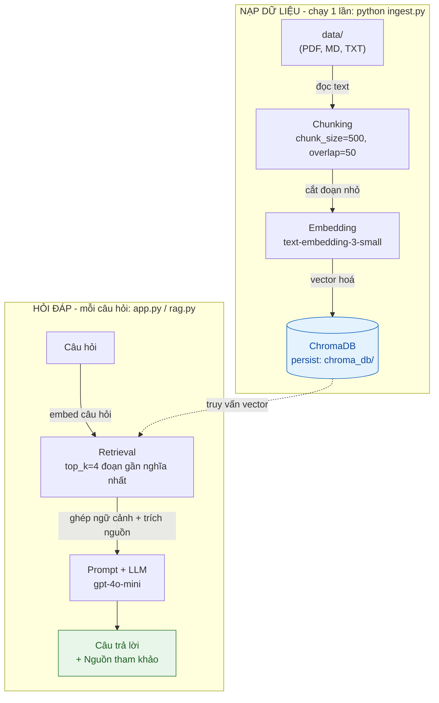

# Bot hỏi đáp FAQ Nội quy công ty (RAG)

Chatbot trả lời câu hỏi **dựa trên tài liệu FAQ bạn cung cấp**, có **trích nguồn** và **không bịa**.
Khi tài liệu không có thông tin, bot trả lời: *"Mình không tìm thấy thông tin này trong tài liệu."*

Xây bằng **RAG (Retrieval-Augmented Generation)**: tìm đoạn tài liệu liên quan trước, rồi mới để LLM trả lời dựa trên đó.

---

## Kiến trúc (luồng xử lý)



**Các file chính:**

| File | Vai trò |
|------|---------|
| `config.py` | Cấu hình MỘT nơi: provider, model, chunk_size, top_k... |
| `ingest.py` | Đọc `data/` -> chunk -> embed -> lưu ChromaDB |
| `rag.py` | Phần lõi: retrieval + ghép prompt + gọi LLM (dùng lại được) |
| `app.py` | Giao diện chat Streamlit |
| `eval.py` | Chấm điểm chất lượng + đo tốc độ |
| `data/` | Tài liệu nguồn của bạn |

---

## Hướng dẫn chạy (Windows PowerShell)

### 1. Tạo môi trường ảo & cài thư viện
```powershell
# Tại thư mục dự án
python -m venv venv
.\venv\Scripts\Activate.ps1
pip install -r requirements.txt
```
> Nếu PowerShell báo lỗi chặn script khi activate, chạy 1 lần:
> `Set-ExecutionPolicy -Scope CurrentUser -ExecutionPolicy RemoteSigned`

### 2. Đặt API key
```powershell
copy .env.example .env
notepad .env      # điền OPENAI_API_KEY=sk-... rồi lưu lại
```
> Lấy key tại https://platform.openai.com/api-keys (cần nạp tối thiểu ~5 USD).

### 3. Nạp dữ liệu vào kho vector (chạy 1 lần)
```powershell
python ingest.py
```

### 4. Chạy giao diện chat
```powershell
streamlit run app.py
```
Trình duyệt sẽ mở tại `http://localhost:8501`. Bắt đầu hỏi!

### (Tuỳ chọn) Chấm điểm chất lượng
```powershell
python eval.py
```

---

## Thay tài liệu của bạn

1. Xoá file mẫu trong `data/` (nếu muốn) và bỏ file **PDF / Markdown / TXT** của bạn vào.
2. Chạy lại:
   ```powershell
   python ingest.py
   ```
   (Lệnh này tự xoá kho cũ và tạo lại từ tài liệu mới - không lo trùng dữ liệu.)
3. Cập nhật `eval_questions.json` cho khớp nội dung tài liệu mới (để chấm điểm đúng).

---

## Đánh giá & cách cải thiện

`python eval.py` chấm theo **3 tầng** để tách rõ lỗi ở khâu *tìm đoạn* hay khâu *trả lời*:

| Tầng | Chỉ số | Ý nghĩa |
|------|--------|---------|
| 1. Retrieval | **Hit Rate@k**, **MRR@k** | Kho vector có lấy đúng đoạn chứa đáp án không? (MRR=1.0 nghĩa là đoạn đúng luôn đứng số 1) |
| 2. Keyword | Số câu đúng | Baseline nhanh, miễn phí - câu trả lời có chứa từ khóa bắt buộc không |
| 3. LLM-judge | Số câu đúng | Dùng LLM chấm "đúng ý" (kể cả diễn đạt khác) - sát người nhất |

```powershell
python eval.py              # chạy đủ 3 tầng (tầng 3 tốn ~10 lượt gọi LLM)
python eval.py --no-judge   # bỏ tầng 3 để khỏi tốn tiền
```

**Cách đọc kết quả để biết sửa khâu nào:**
- **Hit Rate / MRR thấp** -> lỗi khâu *retrieval* (tìm sai đoạn). Sửa: tăng `TOP_K`, chỉnh `CHUNK_SIZE`, hoặc đổi embedding.
- **Retrieval cao nhưng LLM-judge thấp** -> tìm đúng đoạn rồi nhưng LLM trả lời tệ. Sửa: chỉnh `SYSTEM_PROMPT` trong `rag.py`.
- Câu **ngoài tài liệu** (vay mua nhà) mà bot vẫn bịa -> prompt chống-bịa chưa đủ mạnh.

**Các "núm vặn" để cải thiện (chỉnh trong `config.py`):**
| Vấn đề | Thử điều chỉnh |
|--------|----------------|
| Bot thiếu ngữ cảnh, trả lời cụt | Tăng `TOP_K` (4 -> 6) |
| Đoạn bị cắt mất ý | Tăng `CHUNK_SIZE` (500 -> 800) hoặc `CHUNK_OVERLAP` (50 -> 100) |
| Bot lấy đoạn không liên quan | Giảm `CHUNK_SIZE`, viết tài liệu rõ ràng hơn |
| Bot bịa / không trích nguồn | Chỉnh `SYSTEM_PROMPT` trong `rag.py` cho nghiêm hơn |
> Sau mỗi lần đổi tham số chunk, phải chạy lại `python ingest.py`.

---

## Deploy miễn phí lên Streamlit Community Cloud

1. Đẩy code lên GitHub (file `.env` đã được `.gitignore` bỏ qua - **an toàn**).
2. Vào https://share.streamlit.io -> **New app** -> chọn repo, nhánh, file `app.py`.
3. Mục **Advanced settings -> Secrets**, dán key (định dạng TOML):
   ```toml
   PROVIDER = "openai"
   OPENAI_API_KEY = "sk-..."
   ```
4. Bấm **Deploy**.

> Lưu ý: Chroma trên cloud sẽ trống. Cách đơn giản: **commit sẵn thư mục `chroma_db/`** lên GitHub
> (tạm bỏ dòng `chroma_db/` trong `.gitignore`), hoặc gọi `ingest.py` trong `app.py` lần đầu chạy.
> Với dự án portfolio nhỏ, commit sẵn `chroma_db/` là nhanh nhất.

---

## Đổi sang provider miễn phí

Trong `config.py` (hoặc file `.env`) đổi `PROVIDER`:
- **Gemini (free):** `PROVIDER=gemini`, thêm `GOOGLE_API_KEY` vào `.env`, cài `pip install google-generativeai`.
- **Ollama (local):** cài [Ollama](https://ollama.com), chạy `ollama pull nomic-embed-text` và `ollama pull llama3.2`, đặt `PROVIDER=ollama`, cài `pip install ollama`.

Sau khi đổi provider embedding, chạy lại `python ingest.py` (vì vector khác nhau).

---

## Lỗi thường gặp & cách sửa

| Lỗi | Nguyên nhân & cách sửa |
|-----|------------------------|
| `RuntimeError: Chưa có dữ liệu trong Chroma` | Chưa chạy `python ingest.py` trước khi mở app. |
| `openai.AuthenticationError` / 401 | `OPENAI_API_KEY` sai hoặc chưa điền trong `.env`. |
| `RateLimitError` / `insufficient_quota` | Tài khoản OpenAI chưa nạp tiền. Nạp ~5 USD hoặc đổi sang Gemini/Ollama. |
| Không activate được venv (PowerShell) | Chạy `Set-ExecutionPolicy -Scope CurrentUser -ExecutionPolicy RemoteSigned`. |
| Tiếng Việt trong PDF bị lỗi ký tự | Dùng file `.md`/`.txt` UTF-8, hoặc kiểm tra PDF có phải ảnh scan không (cần OCR). |
| Bot trả lời sai dù tài liệu có | Tăng `TOP_K`/`CHUNK_SIZE` rồi chạy lại `ingest.py` (xem mục Đánh giá). |
| Đổi tài liệu nhưng bot vẫn trả lời cũ | Quên chạy lại `python ingest.py`. |
