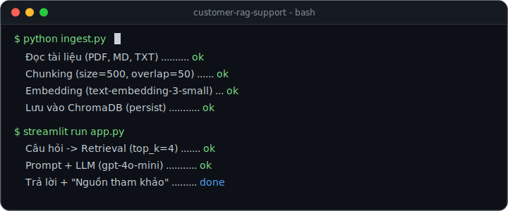
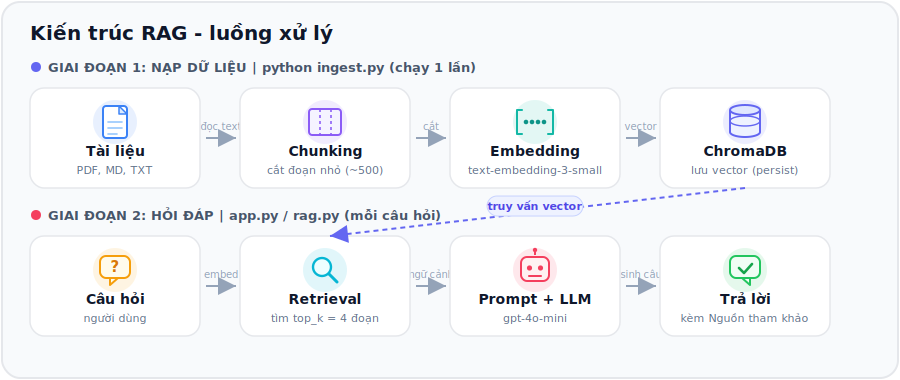
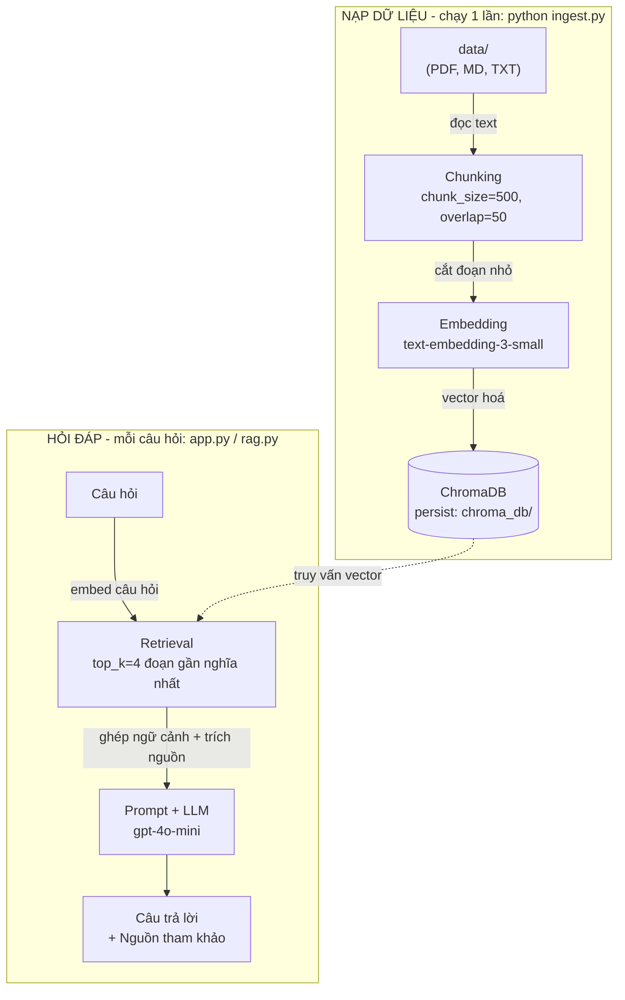

# Bot hỏi đáp FAQ Nội quy công ty (RAG)




> Ảnh terminal phía trên là **ảnh động**: animation chạy khi xem trên GitHub. (Trong preview của VS Code sẽ hiện bản tĩnh đã "gõ" xong — đó là hạn chế của SVG động, không phải lỗi.)

Chatbot trả lời câu hỏi **dựa trên tài liệu FAQ bạn cung cấp**, có **trích nguồn** và **không bịa**.
Khi tài liệu không có thông tin, bot trả lời: *"Mình không tìm thấy thông tin này trong tài liệu."*

Xây bằng **RAG (Retrieval-Augmented Generation)**: tìm đoạn tài liệu liên quan trước, rồi mới để LLM trả lời dựa trên đó.

---

## Tính năng chính

- **Trả lời kèm trích nguồn**: mỗi câu trả lời đính kèm tên tài liệu + đoạn đã dùng.
- **Chống bịa (grounded)**: chỉ trả lời trong phạm vi tài liệu; ngoài phạm vi thì từ chối rõ ràng.
- **Đổi provider 1 dòng**: OpenAI / Google Gemini / Ollama, cấu hình tập trung tại `config.py`.
- **Vector store có persist**: ChromaDB lưu xuống ổ đĩa, không nạp lại mỗi lần chạy.
- **Đánh giá 3 tầng**: retrieval (Hit Rate / MRR), keyword, LLM-as-judge — cho số liệu thật.
- **Giao diện chat**: Streamlit, giữ lịch sử hội thoại, hiển thị Nguồn tham khảo.

## Tech stack

| Thành phần | Công nghệ |
|-----------|-----------|
| Ngôn ngữ | Python 3.10+ |
| LLM + Embedding | OpenAI `gpt-4o-mini` + `text-embedding-3-small` |
| Cắt văn bản | LangChain `RecursiveCharacterTextSplitter` |
| Vector store | ChromaDB (persistent) |
| Giao diện | Streamlit |
| Chất lượng code | ruff (lint/format) · pytest · GitHub Actions CI |

## Demo (self-serve - ai cũng dùng được ngay)

Không cần cài đặt hay chỉnh code:

1. Mở app, ở thanh bên **chọn provider + model** và nhập **API key của bạn** (key chỉ dùng trong phiên, không lưu trữ).
2. **Tải tài liệu của bạn lên** (PDF / Markdown / TXT) - hoặc bấm **Dùng tài liệu mẫu**.
3. Hỏi đáp; câu trả lời kèm **Nguồn tham khảo** trích từ chính tài liệu bạn nạp.

> Cấu hình (provider/model/key) được **khoá theo phiên** lúc nạp tài liệu. Muốn đổi provider/model? Bấm **Nạp tài liệu khác** rồi chọn lại (phải nạp lại vì embedding phụ thuộc model).

> **Quyền riêng tư**: tài liệu xử lý trong bộ nhớ **theo từng phiên** (ChromaDB in-memory), không ghi ra đĩa và không dùng chung giữa người dùng. API key không bị lưu hay ghi log.

- **Live demo**: *(sẽ cập nhật sau khi deploy lên Streamlit Community Cloud)*
- **Chạy local**: xem mục **Hướng dẫn chạy** bên dưới.

---

## Kiến trúc (luồng xử lý)



Hệ thống gồm 2 giai đoạn: **nạp dữ liệu** (offline, chạy 1 lần bằng `ingest.py`) và **hỏi đáp** (mỗi câu hỏi, qua `app.py` / `rag.py`). Khi hỏi, hệ thống truy vấn ngược lại ChromaDB (đường nét đứt) để lấy các đoạn liên quan làm ngữ cảnh.

<details>
<summary>Xem bản Mermaid (GitHub tự render, tiện copy để chỉnh)</summary>



</details>

**Các file chính:**

| File | Vai trò |
|------|---------|
| `config.py` | Cấu hình MỘT nơi: provider, model, chunk_size, top_k... |
| `ingest.py` | Đọc `data/` -> chunk -> embed -> lưu ChromaDB |
| `rag.py` | Phần lõi: retrieval + ghép prompt + gọi LLM (dùng lại được) |
| `app.py` | Giao diện chat Streamlit |
| `eval.py` | Chấm điểm chất lượng + đo tốc độ |
| `data/` | Tài liệu nguồn của bạn |

---

## Hướng dẫn chạy (Windows PowerShell)

### 1. Tạo môi trường ảo & cài thư viện
```powershell
# Tại thư mục dự án
python -m venv venv
.\venv\Scripts\Activate.ps1
pip install -r requirements.txt
```
> Nếu PowerShell báo lỗi chặn script khi activate, chạy 1 lần:
> `Set-ExecutionPolicy -Scope CurrentUser -ExecutionPolicy RemoteSigned`

### 2. Chạy app (cách nhanh nhất - self-serve)
```powershell
streamlit run app.py
```
Mở `http://localhost:8501` -> nhập **OpenAI API key** ở thanh bên -> **tải tài liệu lên** (hoặc bấm **Dùng tài liệu mẫu**) -> hỏi. Không cần `.env` hay `ingest.py`.

### 3. (Tuỳ chọn) Luồng CLI + đánh giá
Dùng khi muốn chạy pipeline bằng dòng lệnh và chấm điểm chất lượng:
```powershell
copy .env.example .env
notepad .env                              # điền OPENAI_API_KEY=sk-...
python ingest.py                          # nạp data/ vào kho vector (persist)
python rag.py "Giờ làm việc là mấy giờ?"  # test nhanh phần lõi
python eval.py                            # chấm điểm 3 tầng
```
> Lấy key tại https://platform.openai.com/api-keys (cần nạp tối thiểu ~5 USD).

---

## Thay tài liệu của bạn

**Cách 1 (nhanh nhất) - upload trên app:** mở app, bấm **Dùng tài liệu khác** ở thanh bên rồi tải file của bạn lên. Không cần dòng lệnh.

**Cách 2 - luồng CLI (cho pipeline/eval):**
1. Xoá file mẫu trong `data/` (nếu muốn) và bỏ file **PDF / Markdown / TXT** của bạn vào.
2. Chạy lại `python ingest.py` (tự xoá kho cũ và tạo lại từ tài liệu mới).
3. Cập nhật `eval_questions.json` cho khớp nội dung tài liệu mới (để chấm điểm đúng).

---

## Đánh giá & cách cải thiện

`python eval.py` chấm theo **3 tầng** để tách rõ lỗi ở khâu *tìm đoạn* hay khâu *trả lời*:

| Tầng | Chỉ số | Ý nghĩa |
|------|--------|---------|
| 1. Retrieval | **Hit Rate@k**, **MRR@k** | Kho vector có lấy đúng đoạn chứa đáp án không? (MRR=1.0 nghĩa là đoạn đúng luôn đứng số 1) |
| 2. Keyword | Số câu đúng | Baseline nhanh, miễn phí - câu trả lời có chứa từ khóa bắt buộc không |
| 3. LLM-judge | Số câu đúng | Dùng LLM chấm "đúng ý" (kể cả diễn đạt khác) - sát người nhất |

```powershell
python eval.py              # chạy đủ 3 tầng (tầng 3 tốn ~10 lượt gọi LLM)
python eval.py --no-judge   # bỏ tầng 3 để khỏi tốn tiền
```

**Kết quả trên bộ 10 câu hỏi mẫu** *(chạy `python eval.py` bằng key của bạn rồi điền số thật vào đây):*

| Chỉ số | Kết quả |
|--------|---------|
| Hit Rate@4 (retrieval) | `__ / 9` |
| MRR@4 | `0.__` |
| Keyword | `__ / 10` |
| LLM-judge | `__ / 10` |
| Thời gian TB mỗi câu | `__ s` |

**Cách đọc kết quả để biết sửa khâu nào:**
- **Hit Rate / MRR thấp** -> lỗi khâu *retrieval* (tìm sai đoạn). Sửa: tăng `TOP_K`, chỉnh `CHUNK_SIZE`, hoặc đổi embedding.
- **Retrieval cao nhưng LLM-judge thấp** -> tìm đúng đoạn rồi nhưng LLM trả lời tệ. Sửa: chỉnh `SYSTEM_PROMPT` trong `rag.py`.
- Câu **ngoài tài liệu** (vay mua nhà) mà bot vẫn bịa -> prompt chống-bịa chưa đủ mạnh.

**Các "núm vặn" để cải thiện (chỉnh trong `config.py`):**
| Vấn đề | Thử điều chỉnh |
|--------|----------------|
| Bot thiếu ngữ cảnh, trả lời cụt | Tăng `TOP_K` (4 -> 6) |
| Đoạn bị cắt mất ý | Tăng `CHUNK_SIZE` (500 -> 800) hoặc `CHUNK_OVERLAP` (50 -> 100) |
| Bot lấy đoạn không liên quan | Giảm `CHUNK_SIZE`, viết tài liệu rõ ràng hơn |
| Bot bịa / không trích nguồn | Chỉnh `SYSTEM_PROMPT` trong `rag.py` cho nghiêm hơn |
> Sau mỗi lần đổi tham số chunk, phải chạy lại `python ingest.py`.

---

## Deploy miễn phí lên Streamlit Community Cloud

1. Đẩy code lên GitHub (file `.env` đã được `.gitignore` bỏ qua - **an toàn**).
2. Vào https://share.streamlit.io -> **New app** -> chọn repo, nhánh, file `app.py`.
3. Bấm **Deploy**. Xong! **Không cần đặt Secrets** - mỗi người dùng tự nhập OpenAI key của họ trên giao diện.

> App dùng kho vector **in-memory theo phiên** từ tài liệu người dùng upload, nên KHÔNG cần `chroma_db/` trên cloud.
>
> Muốn TỰ trả tiền (khách khỏi nhập key)? Đặt `OPENAI_API_KEY` vào **Secrets** rồi sửa `app.py` ưu tiên lấy key từ `st.secrets` - nhớ kèm giới hạn (dung lượng, số câu hỏi) để tránh bị lạm dụng.

---

## Đổi sang provider miễn phí

Trong `config.py` (hoặc file `.env`) đổi `PROVIDER`:
- **Gemini (free):** `PROVIDER=gemini`, thêm `GOOGLE_API_KEY` vào `.env`, cài `pip install google-generativeai`.
- **Ollama (local):** cài [Ollama](https://ollama.com), chạy `ollama pull nomic-embed-text` và `ollama pull llama3.2`, đặt `PROVIDER=ollama`, cài `pip install ollama`.

Sau khi đổi provider embedding, chạy lại `python ingest.py` (vì vector khác nhau).

---

## Lỗi thường gặp & cách sửa

| Lỗi | Nguyên nhân & cách sửa |
|-----|------------------------|
| `RuntimeError: Chưa có dữ liệu trong Chroma` | Chưa chạy `python ingest.py` trước khi mở app. |
| `openai.AuthenticationError` / 401 | `OPENAI_API_KEY` sai hoặc chưa điền trong `.env`. |
| `RateLimitError` / `insufficient_quota` | Tài khoản OpenAI chưa nạp tiền. Nạp ~5 USD hoặc đổi sang Gemini/Ollama. |
| Không activate được venv (PowerShell) | Chạy `Set-ExecutionPolicy -Scope CurrentUser -ExecutionPolicy RemoteSigned`. |
| Tiếng Việt trong PDF bị lỗi ký tự | Dùng file `.md`/`.txt` UTF-8, hoặc kiểm tra PDF có phải ảnh scan không (cần OCR). |
| Bot trả lời sai dù tài liệu có | Tăng `TOP_K`/`CHUNK_SIZE` rồi chạy lại `ingest.py` (xem mục Đánh giá). |
| Đổi tài liệu nhưng bot vẫn trả lời cũ | Quên chạy lại `python ingest.py`. |
